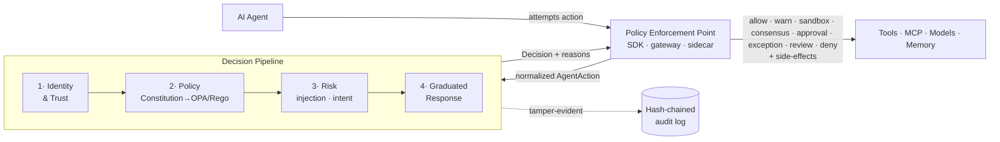

<div align="center">

# 🛡️ agentos-guard

### The governance & security control plane for AI agents

*Intercept every agent action. Reason about it. Respond on a spectrum. Prove it happened.*

[](LICENSE)
[](https://www.python.org/)
[](https://github.com/JitendraJha98/agentos-guard/actions/workflows/ci.yml)
[](.planning/ROADMAP.md)
[](#-contributing)

[**Manifesto**](docs/architecture/00-manifesto.md) · [**Architecture**](docs/architecture/) · [**Roadmap**](.planning/ROADMAP.md) · [**vs Microsoft AGT**](docs/architecture/30-comparison-agt.md)

</div>

---

agentos-guard sits between your AI agents and everything they touch — **tools, memory, MCP servers,
models, APIs, and each other** — and intercepts **every action before it executes**. Each action is
checked against a living, human-readable **constitution** and deterministic policy, scored for risk,
bound to a cryptographic identity + trust score, and returned a **graduated decision**. Every
decision becomes tamper-evident audit evidence, and a pytest-native red-team layer makes a safety
regression **break your CI build** like a failing unit test.

Think *Kubernetes + OPA + Istio + a flight recorder* — but for autonomous agents, in one
self-hostable control plane.

## ✨ The paradigm

Most agent-governance tools — including Microsoft's Agent Governance Toolkit — run one reflex:

```
Distrust  →  Block  →  Log          (static rules · binary verdict · append-only log)
```

That's a firewall bolted in front of a reasoning system. agentos-guard runs a different reflex:

```
Trust  →  Verify  →  Graduate  →  Prove
```

> Establish **who** is acting and how much they've earned trust. **Verify** against a constitution
> that reasons about *intent*, not just matching strings. **Graduate** the response across a
> spectrum instead of a coin-flip. And make the evidence **provable**, not merely append-only.

Full thesis → [`docs/architecture/00-manifesto.md`](docs/architecture/00-manifesto.md).

## 🏛️ How it works



1. **Intercept** — a Policy Enforcement Point captures the action before it runs.
2. **Normalize** — it becomes one `AgentAction` event, regardless of framework.
3. **Decide** — the synchronous pipeline runs `identity/trust → policy → risk → graduated response`.
4. **Enforce** — allow, warn, sandbox, require consensus, escalate to a human, grant a time-boxed exception, open an async governance review, or deny — with composable side-effects (notify · monitor · risk-flag · open-incident).
5. **Record** — a signed, hash-chained audit record + OpenTelemetry spans.

## 🚀 Why agentos-guard — the seven pillars

Each pillar names a weakness in the static/binary model and the answer. **None requires blockchain
or tokens** ([ADR-0007](docs/architecture/adr/0007-no-crypto-economics-in-core.md)).

| # | Instead of… | agentos-guard gives you | |
|---|-------------|--------------------------|---|
| 1 | static YAML rules | a **living semantic constitution** agents can query | [04](docs/architecture/04-constitution-and-policy.md) |
| 2 | binary allow/deny | **graduated response** — allow · warn · sandbox · consensus · approval · time-boxed exception · async review · deny + composable side-effects | [04](docs/architecture/04-constitution-and-policy.md) |
| 3 | action-string matching | **intent-based policy** — catches `rename_then_drop` & novel sequences | [05](docs/architecture/05-security-and-runtime.md) |
| 4 | per-agent isolation | **cross-agent permission calculus** — catches the confused-deputy in delegation | [06](docs/architecture/06-identity-trust-discovery.md) |
| 5 | `GovernanceDenied: rule X` | **explainable denials with remediation paths** | [02](docs/architecture/02-domain-model.md) |
| 6 | offline pre-deploy red-team | a **CI-gating** red-team that breaks the build + self-play | [08](docs/architecture/08-testing-and-redteam.md) |
| 7 | append-only "tamper-evident" logs | **provable** evidence: provenance → Merkle → zero-knowledge proofs | [07](docs/architecture/07-audit-and-compliance.md) |

## 🆚 vs. Microsoft AGT (honest)

| Dimension | AGT / RAMPART | agentos-guard |
|-----------|---------------|---------------|
| Policy | Static YAML, string match | Semantic constitution + intent reasoning |
| Enforcement | Allow / deny | Six graduated outcomes |
| Denials | Rule id | Cited principle + evidence + remediation |
| Red-team | Offline, pre-deploy | Continuous, **gates CI**, self-play |
| Audit | Append-only log | Provenance now → Merkle → ZK proofs |

We're inspired by AGT and aim to surpass it — and we say where we are: Phase 1 already
*out-features* AGT on graduated/semantic/CI-gating; breadth of detectors and adapters is where we
reach parity as the roadmap lands. Full scorecard →
[`30-comparison-agt.md`](docs/architecture/30-comparison-agt.md).

## 📦 Project status

> **Alpha — building in public, in vertical slices.** Not yet published to PyPI.

**✅ Shipped (Phase 1 — the walking skeleton):** one LangGraph agent, one governed tool, one
constitution principle, proven **end-to-end** — interception → `AgentAction` → identity (EdDSA) →
OPA/Rego policy → prompt-injection risk → graduated response → hash-chained fail-closed audit — with
a red-team test that **breaks CI if the policy is removed**.

**🛠️ Next:** full five-action interception coverage → authoring constitution + approvals → verifiable
audit + kill switches → control-plane API + SDK + dashboard → compliance + the CI red-team gate.
See the 14-phase [roadmap](.planning/ROADMAP.md).

## ⚡ Explore from source

Real code lives under [`packages/`](packages/) as a [uv](https://docs.astral.sh/uv/) workspace.

```bash
git clone https://github.com/JitendraJha98/agentos-guard.git
cd agentos-guard

uv sync            # install the workspace + dev tooling from the lockfile
uv run pytest      # run the suite, including the red-team CI gate
```

> The policy layer compiles Rego to WASM, so a recent [`opa`](https://www.openpolicyagent.org/docs/cli)
> binary on your `PATH` is needed for the policy tests (CI does this automatically).

## 🗂️ Repository layout

Two layers, deliberately separate — **`docs/` defines, `.planning/` executes and references it**:

| Path | What it is |
|------|------------|
| [`docs/`](docs/) | **Design** (authoritative — *what & why*). Start at the [manifesto](docs/architecture/00-manifesto.md). |
| [`.planning/`](.planning/) | **Execution** (GSD — *how & when*): requirements, roadmap, phase history, research. |
| [`packages/`](packages/) | The code: `contract` (stable boundary) · `pipeline` (the PDP) · `controlplane` · `sdk`. |
| [`CLAUDE.md`](CLAUDE.md) | Contributor & agent working guidance. |

Each of `docs/` and `.planning/` has its own README explaining the split, so the two never blur.

## 🧰 Built with

Python 3.12+ · LangChain / LangGraph (interception) · Open Policy Agent / Rego (policy) ·
Pydantic v2 · SQLAlchemy 2.0 + asyncpg + Alembic on PostgreSQL · stdlib hash-chain audit ·
OpenTelemetry · garak / PyRIT under pytest (red-team). Rust is reserved for hot-path enforcement
later, where profiling justifies it. Decisions are recorded as [ADRs](docs/architecture/adr/).

## 🤝 Contributing

Early-stage and contributor-friendly. Good first steps: read the
[manifesto](docs/architecture/00-manifesto.md), skim the [roadmap](.planning/ROADMAP.md), and open an
issue to discuss before a PR. Feature work happens on the `development` branch (see
[`CLAUDE.md`](CLAUDE.md)).

## 📄 License

[MIT](LICENSE) © 2026 Jitendra Jha — open-source, self-hosted first.

<div align="center">
<sub>Governance as a collaborative, evolving system — not a static firewall.</sub>
</div>
