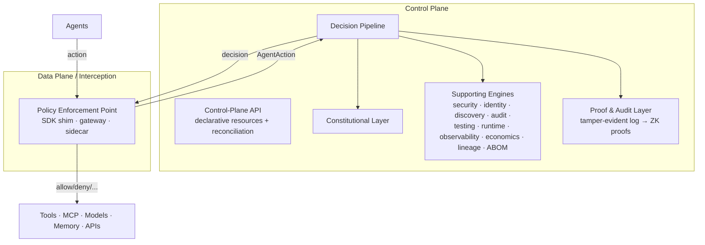

# 01 — Overview

> **The AGT weakness this kills:** AGT governs *before* deployment (red-team) or *after* the
> fact (logs), with the policy engine sharing the agent's process. There is no runtime control
> plane that intercepts *every* action and makes unsafe behavior structurally impossible. This
> doc establishes that control plane — and the process boundary AGT lacks.
>
> *New here? Read [`00-manifesto.md`](00-manifesto.md) first for the paradigm and the seven pillars.*

## The problem

Enterprises are deploying thousands of AI agents that call tools, query databases, hold
memory, talk to MCP servers, invoke models, and delegate to one another. There is no unified
way to **see** what every agent is doing, **prove** why an action was allowed, **govern**
its permissions, **secure** it against prompt injection and exfiltration, or **test** it for
safety regressions before they reach production. Existing tools enforce rules either *before*
deployment (red-teaming) or *after* the fact (audit logs). What is missing is a **runtime
control plane** that intercepts every action and makes unsafe behavior *structurally
impossible* rather than merely unlikely.

## Goals

- Intercept **every** agent action (tool, memory, MCP, model, delegation) at runtime.
- Evaluate each action against declarative policy **and** a human-readable constitution.
- Return a **graduated** decision, not just allow/deny.
- Attach **cryptographic identity** and a **trust score** to every actor.
- Produce **tamper-evident** compliance evidence (OWASP Agentic Top 10, NIST AI RMF, EU AI
  Act, SOC2).
- Ship a **pytest-native** safety/red-team layer so safety regressions fail CI.
- Give platform teams **fleet-wide discovery, observability, and kill switches**.

## Non-goals (for now)

- Training or hosting the agents themselves — agentos-guard governs agents, it is not an
  agent framework.
- A managed SaaS — the project is open-source and self-hosted first.
- Replacing existing observability backends — we emit OpenTelemetry and integrate.

## The control-plane model

agentos-guard borrows Kubernetes' mental model: a **data plane** (the enforcement points
that sit in the request path) and a **control plane** (the engines that decide, store state,
and observe).

## Request lifecycle (the heart of the system)

1. **Intercept.** An agent attempts an action; the PEP captures it.
2. **Normalize.** The action becomes a single `AgentAction` event (see
   [`02-domain-model.md`](02-domain-model.md)).
3. **Decide.** The synchronous **Decision Pipeline** runs:
   `identity/trust → policy (Constitution→OPA) → risk score → graduated response`.
4. **Enforce.** The PEP applies the decision: allow, warn, sandbox, require consensus,
   escalate to a human, or deny.
5. **Record.** A signed decision record is appended to the tamper-evident audit log and
   emitted as OpenTelemetry spans/metrics.

This lifecycle is the contract every other engine plugs into. Phase 0 implements it for the
LangChain/LangGraph SDK; later phases add gateway and Kubernetes interception without
changing the pipeline contract.
