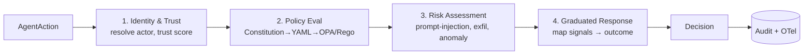

# 03 — Interception & the Decision Pipeline

> **The AGT weakness this kills:** AGT's policy engine runs *in-process* with the agent, so a
> compromised agent can compromise its own governance, and interception is tied to one
> integration shape. Our PEP is a process boundary behind a single stable contract
> (`evaluate(AgentAction) -> Decision`) — SDK now, gateway and K8s sidecar later — so the same
> pipeline governs every agent regardless of framework, and the decision is made outside the
> agent's reach.

## Policy Enforcement Points (PEP)

A PEP is anywhere an `AgentAction` is captured before it executes. agentos-guard supports
multiple PEP forms behind one contract, so the pipeline never changes:

| PEP form | Phase | How it works |
|----------|-------|--------------|
| **SDK interception** | 0 | Python middleware/decorators wrap LangChain/LangGraph tool, memory, model, and delegation calls. Lowest-friction adoption. |
| **Gateway / proxy** | 1 | A network proxy in front of LLM / MCP / tool endpoints intercepts framework-agnostically. |
| **K8s sidecar / operator** | 2 | True Kubernetes-style data plane: a sidecar intercepts traffic; an operator reconciles policy. |

### Phase 0: LangChain / LangGraph SDK shim

The shim wraps the framework's tool-execution, memory, model, and sub-agent boundaries,
emits a normalized `AgentAction`, calls the Decision Pipeline synchronously, and enforces the
returned outcome. Conceptually:

```
@governed
async def run_tool(tool, args, ctx):
    action = normalize(tool, args, ctx)        # -> AgentAction
    decision = await pipeline.evaluate(action) # control-plane call
    return enforce(decision, lambda: tool(args))  # allow/sandbox/deny/...
```

`enforce` is where graduated outcomes are realized: `allow` runs the tool; `sandbox` runs it
in an isolated context ([`05`](05-security-and-runtime.md)); `require_approval` parks an
`ApprovalRequest`; `deny` raises a governed exception with the decision reasons attached.

## The Decision Pipeline

A synchronous, ordered set of stages. Each stage can short-circuit to a terminal outcome, and
every stage contributes `reasons` for explainability. Ordering matters: identity before
policy (policy may depend on who the actor is), policy before risk (risk may be policy-gated),
risk before the graduated decision.



1. **Identity & Trust** — resolve which `Agent` is acting, verify its identity token, load
   its `TrustProfile`. Unknown/forged identity can short-circuit to `deny`.
   ([`06`](06-identity-trust-discovery.md))
2. **Policy Evaluation** — compile/lookup the relevant `Constitution`+`Policy`, evaluate via
   OPA/Rego. Ambiguous cases route to the LLM semantic interpreter.
   ([`04`](04-constitution-and-policy.md))
3. **Risk Assessment** — the security engine scores the action: prompt-injection detection,
   data-exfiltration heuristics, tool-poisoning checks, anomaly detection.
   ([`05`](05-security-and-runtime.md))
4. **Graduated Response** — combine policy result + risk + trust into one outcome on the
   spectrum allow → warn → sandbox → consensus → human-approval → deny.
   ([`04`](04-constitution-and-policy.md))

## Performance & failure posture

- The pipeline is on the hot path; Phase 0 targets low single-digit-ms overhead for cached
  policy/identity. Heavy checks (LLM interpreter, full anomaly models) run only when cheaper
  stages flag ambiguity.
- **Fail-safe vs. fail-open is a policy decision per agent/action class.** High-risk action
  classes default to fail-closed (deny on control-plane unavailability); low-risk classes may
  fail-open with a logged warning. This is configured, not hard-coded.
- Hot-path components are the first candidates for the Phase 2 Rust rewrite
  ([`adr/0001-python-first.md`](adr/0001-python-first.md)).
