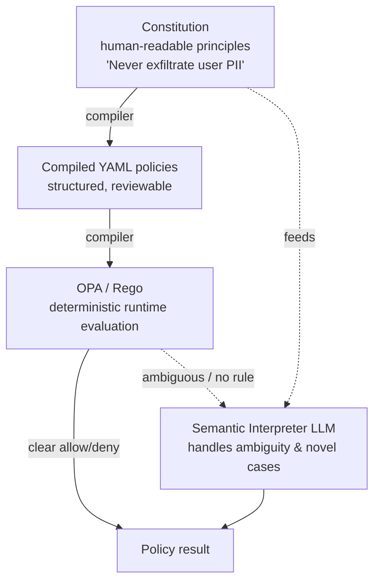

# 04 — Constitution, Policy & Graduated Response

> **The AGT weakness this kills (pillars 1 & 2):** AGT freezes rules as static YAML at deploy
> time and enforces a binary allow/deny — string-matching with no rationale and no middle
> ground, so complex workflows either pass or crash. We give agents a **living constitution**
> they can reason about, compiled to a deterministic policy core, with a **graduated** range of
> outcomes tuned by risk and trust.

This is agentos-guard's signature differentiator. We give agents a **living constitution** they
can reason about, compiled to a deterministic policy core, with a **graduated** range of
outcomes.

## The three-layer policy stack

1. **Constitution (authoring).** Principles in plain language, organized and numbered
   (e.g. *Principle 3.2 — data privacy*). Human-owned, version-controlled, reviewable by
   non-engineers. This is what auditors and stakeholders read.
2. **Compiled YAML (structured policy).** A compiler lowers constitution principles into
   structured, declarative YAML policies scoped to agents, tools, and action types. This is
   the reviewable middle layer.
3. **OPA / Rego (enforcement).** YAML compiles to Rego for fast, deterministic, side-effect-
   free evaluation on the hot path. OPA is CNCF-graduated, fitting the Kubernetes branding and
   giving us a battle-tested engine. See
   [`adr/0003-opa-rego-policy-substrate.md`](adr/0003-opa-rego-policy-substrate.md).

### Semantic interpreter (the reasoning layer)

When the deterministic core has no rule or returns ambiguity, the action + relevant
constitution principles are handed to an LLM-based **semantic interpreter**. It returns a
recommended outcome *with a cited principle and rationale* — never an unexplained verdict.
Its decisions feed back as proposed policy refinements (Phase 2 amendments).

## Graduated Response engine

The pipeline's final stage maps `{policy result, risk score, trust score}` to one outcome:

| Outcome | When | Effect |
|---------|------|--------|
| **allow** | Clear pass, low risk, trusted agent | Action executes normally. |
| **warn** | Minor/advisory concern | Executes, logged as an advisory finding. |
| **sandbox** | Moderate risk or untrusted agent | Executes in an isolated context ([`05`](05-security-and-runtime.md)); effects quarantined. |
| **require_consensus** | High-impact, ambiguous | Needs 2-of-3 agent agreement (Phase 1+). |
| **require_approval** | High risk / sensitive scope | Parks an `ApprovalRequest`; human decides with full context (blocking). |
| **temporary_exception** | Otherwise-denied, but a human ratifies a time-boxed exception | Action is allowed until `expires_at`, then auto-revokes; recorded as evidence. **Human-ratified only — the semantic interpreter may *recommend* one but can never grant it** (this preserves the deterministic policy floor; an LLM must never relax a hard denial). |
| **governance_review** | Allowed to proceed, but warrants scrutiny | Action executes and an **asynchronous, non-blocking** governance review is opened — unlike `require_approval`, work is not held. |
| **deny** | Clear violation or forged identity | Blocked; governed exception with cited reasons. |

The mapping itself is policy-driven (configurable thresholds), so teams tune strictness per
agent class without code changes.

### Composable side-effects

The outcome above is the single *gating* verdict. Orthogonal to it, a `Decision` may carry any
subset of **side-effects** — `notify`, `additional_monitoring`, `risk_flag`, `create_incident` —
that ride alongside *any* outcome (e.g. `allow + additional_monitoring + risk_flag`, or
`deny + create_incident`). This keeps the gating spectrum deliberately small while letting one
decision both permit work *and* escalate observation/incident response, instead of inventing a
combinatorial explosion of outcome variants.

## Amendments & conflict resolution (Phase 2)

- **Amendment proposals:** agents (or the self-play trainer) can propose constitution changes;
  humans review and ratify. The constitution evolves like a versioned legal document.
- **Conflict resolution engine:** when delegation composes permissions (Agent A can *read*
  email, Agent B can *send* — can the chain *forward externally*?), the engine computes the
  transitive permission set and flags emergent conflicts. See cross-agent reasoning in
  [`06`](06-identity-trust-discovery.md).

## Human approval workflow

`require_approval` creates an `ApprovalRequest` carrying the full `AgentAction` context, the
fired principles, and the risk/trust scores. Approvers act via the dashboard or API; the
agent's action blocks (or times out to a safe default) until resolved. Every approval is
itself an `AuditRecord`.
