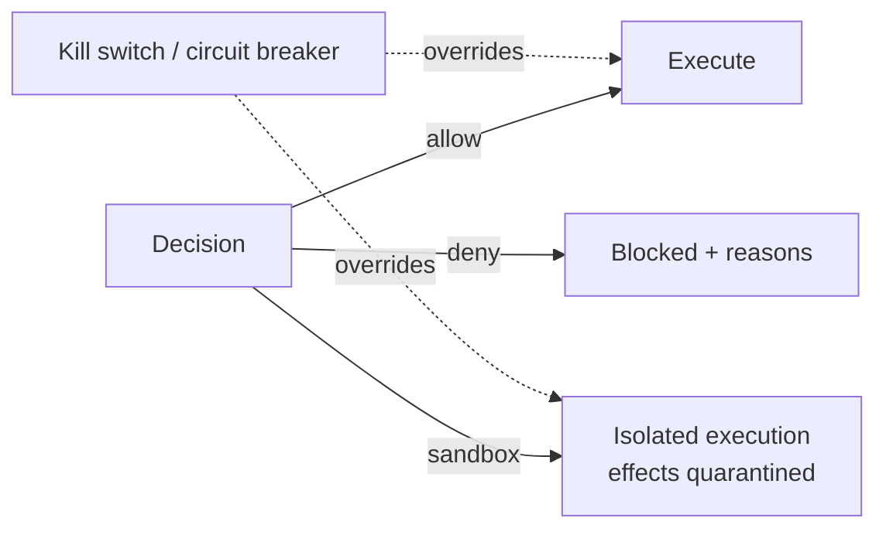

# 05 — Security Engine & Runtime Security

Two cooperating concerns: the **Security Engine** scores *risk* during the Decision Pipeline
(stage 3), and **Runtime Security** *contains* execution when an outcome is `sandbox` or worse.

## Security Engine (detection / risk scoring)

Runs as pipeline stage 3 and emits a `risk_score` plus typed findings.

| Capability | Phase | What it detects |
|------------|-------|-----------------|
| **Prompt-injection protection** | 0 | Injection patterns in tool inputs, retrieved content, and inter-agent messages. |
| **Runtime guardrails** | 0 | Baseline input/output guardrails (PII, unsafe content, format violations). |
| **Data-exfiltration protection** | 1 | Outbound payloads carrying secrets/PII to untrusted targets. |
| **Secret-leakage prevention** | 1 | Credentials/keys in prompts, tool args, or outputs. |
| **Tool-poisoning detection** | 1 | Malicious or drifted tool definitions/descriptions. |
| **MCP security gateway** | 1 | Inspects/normalizes MCP server interactions; quarantines hostile tool manifests. |
| **Supply-chain security** | 1 | Cross-checks the agent's ABOM ([`09`](09-observability-economics-abom.md)) against known-bad models/prompts/tools. |

Detectors are pluggable scorers; each returns a normalized contribution to `risk_score` and a
finding with evidence. Cheap heuristics run inline; expensive models run only when flagged.

## Runtime Security (containment / response)

Realizes the non-`allow` outcomes and provides the platform-team safety levers.

| Capability | Phase | Purpose |
|------------|-------|---------|
| **Sandboxed execution** | 1 | Run a flagged action in an isolated context with no real side effects (or reversible ones), so behavior can be observed safely. |
| **Privilege rings** | 1 | Tiered capability levels per agent; sensitive tools require a higher ring. |
| **Resource isolation** | 1 | CPU/memory/network limits per agent execution. |
| **Circuit breakers** | 1 | Auto-trip an agent/tool after a threshold of violations or errors. |
| **Kill switches** | 0 (basic) | Operator-triggered immediate halt of an agent or whole fleet. |
| **Emergency shutdown** | 1 | Fleet-wide stop with audit-logged justification. |

## Design notes

- **Kill switches ship in Phase 0** even though full sandboxing is Phase 1: an operator must
  be able to stop a runaway agent from day one, even if the only response below it is `deny`.
- Sandbox semantics depend on the PEP: the SDK shim can intercept and stub side-effectful
  tools; the gateway/sidecar (later phases) can enforce network-level isolation.
- All findings and containment actions are `AuditRecord`s ([`07`](07-audit-and-compliance.md))
  and OTel events ([`09`](09-observability-economics-abom.md)).
