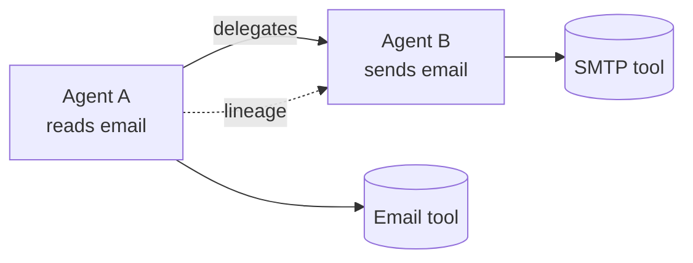

# 06 — Identity, Trust, Discovery & the Agent Graph

> **The AGT weakness this kills (pillar 4):** AGT gives each agent its own policy and SPIFFE/mTLS
> identity, but has no notion of *composed* risk. When Agent A (can *read* email) delegates to
> Agent B (can *send* email), neither agent's policy sees that the **chain** can now forward
> internal mail externally — the classic *confused deputy*. Our trust layer is dynamic
> (reputation, not a static allowlist) and the agent graph powers a **cross-agent permission
> calculus** that computes transitive permissions and flags the emergent capability.

This layer answers *who is acting, how much do we trust them, and what exists in our fleet?*

## Agent Identity

Every actor has a verifiable identity, resolved as pipeline stage 1.

| Capability | Phase | Notes |
|------------|-------|-------|
| **Agent identity management** | 0 | Each `Agent` is registered and issued a signed identity token. |
| **Agent certificates** | 1 | X.509-style certs binding identity to keys. |
| **SPIFFE integration** | 2 | Standards-based workload identity (SPIFFE/SVID) for zero-trust mTLS. |

Forged or unknown identity is a short-circuit `deny` in the pipeline.

## Trust & Reputation

Trust is **dynamic**, not a static allowlist — a key differentiator over AGT's SPIFFE/mTLS-only
identity.

| Capability | Phase | Notes |
|------------|-------|-------|
| **Trust score** | 0 (basic) | A 0–1 score per agent, consumed by the graduated-response stage. |
| **Reputation score** | 1 | Longitudinal reputation from violation/approval history. |
| **Trust propagation** | 1 | Trust flows (and decays) across delegation edges. |
| **Delegation trust chains** | 1 | A delegated action inherits a bounded trust budget from its parent. |
| **Portable reputation** | 2 | Longitudinal reputation is exportable across deployments. Any stake/slashing economics live in an **optional, deployment-pluggable** backend only — never required to run the control plane ([ADR-0007](adr/0007-no-crypto-economics-in-core.md)). |

## Discovery

You cannot govern what you cannot see. The discovery engine builds and maintains a live
inventory.

| Capability | Phase | Notes |
|------------|-------|-------|
| **Automatic agent discovery** | 0 (LangGraph) | Agents self-register via the SDK; later, gateway/sidecar traffic reveals them. |
| **Framework discovery** | 1 | Detect LangChain/LangGraph, CrewAI, AutoGen, OpenAI Agents SDK, MCP, etc. |
| **Agent inventory management** | 0 | The authoritative list of known agents, tools, prompts, memories. |
| **Shadow-agent detection** | 1 | Flag agents acting without registration. |
| **Rogue-agent detection** | 1 | Flag agents whose behavior diverges from declared scope. |

## The Live Agent Graph & Lineage

A materialized graph of agents, tools, MCP servers, models, memories, and the **delegation
edges** between agents — the "what talks to what" map that powers governance reasoning.



**Lineage** (parent/child relationships, delegation tracking, agent family trees) is derived
from `AgentAction.context.parent_action_id` and drives root-cause analysis and decision
provenance during incidents.

## Cross-agent permission calculus (the pillar-4 differentiator)

Static, per-agent rules are blind to *composition*. The classic failure is the **confused
deputy**: each agent in a delegation chain is individually compliant, yet the chain as a whole
acquires a capability none of them should have.

```
Agent A.read_email  ──delegates──▶  Agent B.send_email
        └────────── effective capability: forward_email_externally ──────────┘
```

The agent graph supplies the delegation edges and information-flow paths; the **permission
calculus** walks them to compute each chain's *effective* (transitive) permission set, then
checks that set against the constitution:

1. Build the transitive permission graph from delegation edges.
2. Identify information-flow paths (who can move what, to where).
3. Compute effective permissions across the chain (`A.read + B.send → forward_externally`).
4. Check the effective set against constitutional principles
   ([`04`](04-constitution-and-policy.md)'s conflict engine).
5. On a violation, require explicit approval or **block the delegation** — before it executes.

| Capability | Phase | Notes |
|------------|-------|-------|
| **Delegation lineage + bounded trust budget** | 1 | Delegated scope is an **intersection** (never a union) of parent and child scope; trust decays across the edge. |
| **Transitive permission computation** | 2 | The conflict-resolution engine computes effective permissions across full delegation chains. |
| **Emergent-capability flagging** | 2 | Chains whose effective set violates a principle are flagged/blocked with the offending path cited in `reasons`. |

This is the catch static rules structurally cannot make: the danger lives in the *edge between*
agents, not in any single agent's policy.
