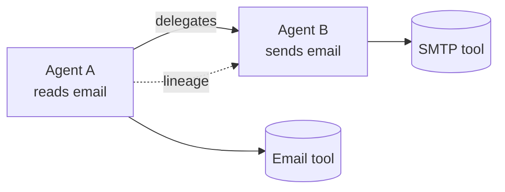

# 06 — Identity, Trust, Discovery & the Agent Graph

This layer answers *who is acting, how much do we trust them, and what exists in our fleet?*

## Agent Identity

Every actor has a verifiable identity, resolved as pipeline stage 1.

| Capability | Phase | Notes |
|------------|-------|-------|
| **Agent identity management** | 0 | Each `Agent` is registered and issued a signed identity token. |
| **Agent certificates** | 1 | X.509-style certs binding identity to keys. |
| **SPIFFE integration** | 2 | Standards-based workload identity (SPIFFE/SVID) for zero-trust mTLS. |

Forged or unknown identity is a short-circuit `deny` in the pipeline.

## Trust & Reputation

Trust is **dynamic**, not a static allowlist — a key differentiator over AGT's SPIFFE/mTLS-only
identity.

| Capability | Phase | Notes |
|------------|-------|-------|
| **Trust score** | 0 (basic) | A 0–1 score per agent, consumed by the graduated-response stage. |
| **Reputation score** | 1 | Longitudinal reputation from violation/approval history. |
| **Trust propagation** | 1 | Trust flows (and decays) across delegation edges. |
| **Delegation trust chains** | 1 | A delegated action inherits a bounded trust budget from its parent. |
| **Stake-based accountability** | 2 | Agents stake on their behavior; violations slash stake; reputation is portable across deployments. |

## Discovery

You cannot govern what you cannot see. The discovery engine builds and maintains a live
inventory.

| Capability | Phase | Notes |
|------------|-------|-------|
| **Automatic agent discovery** | 0 (LangGraph) | Agents self-register via the SDK; later, gateway/sidecar traffic reveals them. |
| **Framework discovery** | 1 | Detect LangChain/LangGraph, CrewAI, AutoGen, OpenAI Agents SDK, MCP, etc. |
| **Agent inventory management** | 0 | The authoritative list of known agents, tools, prompts, memories. |
| **Shadow-agent detection** | 1 | Flag agents acting without registration. |
| **Rogue-agent detection** | 1 | Flag agents whose behavior diverges from declared scope. |

## The Live Agent Graph & Lineage

A materialized graph of agents, tools, MCP servers, models, memories, and the **delegation
edges** between agents — the "what talks to what" map that powers governance reasoning.

**Cross-agent legal reasoning** (Phase 2, with [`04`](04-constitution-and-policy.md)'s
conflict engine): when A (can read) delegates to B (can send), the transitive permission set
might enable *external forwarding* that neither agent should have. The graph supplies the
edges; the conflict-resolution engine computes and flags the emergent capability.

**Lineage** (parent/child relationships, delegation tracking, agent family trees) is derived
from `AgentAction.context.parent_action_id` and drives root-cause analysis and decision
provenance during incidents.
