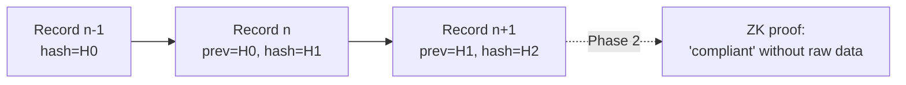

# 07 — Audit & Compliance (the Proof Layer)

> **The AGT weakness this kills (pillar 7):** AGT's "tamper-evident" means append-only JSON.
> Whoever controls the host can rewrite the log and recompute the hashes — *evidence without
> proof*. We add **policy-version provenance** on every record, an **independent CI verifier**
> and external anchoring of chain checkpoints, and a Phase-2 path to **zero-knowledge proofs**
> that demonstrate compliance *without disclosing* the underlying data. Proof, not just a log.

Every decision the control plane makes becomes **evidence**. This layer makes that evidence
**tamper-evident**, queryable, and mapped to the compliance frameworks enterprises must answer
to.

## Tamper-evident audit log

| Capability | Phase | Design |
|------------|-------|--------|
| **Immutable audit logs** | 0 | Append-only table where each `AuditRecord` includes the hash of the previous record (**hash chain**). Any retroactive edit breaks the chain and is detectable. |
| **Decision records** | 0 | Each record links `AgentAction` → `Decision` → fired policies/principles → outcome. |
| **Policy evidence** | 0 | Records carry the exact policy/constitution version that evaluated the action. |
| **Per-record signatures** | 0 | Each `AuditRecord` carries a detached control-plane signature (EdDSA, reusing the identity keys of [`06`](06-identity-trust-discovery.md)) so any *single* record verifies on its own — proof that *this* decision was issued by the control plane, independent of the chain links and complementing the externally-anchored checkpoints. |
| **Merkle DAG logs** | 1 | Upgrade the hash chain to a Merkle DAG for efficient inclusion proofs and partial disclosure. |
| **Zero-knowledge compliance proofs** | 2 | Prove properties (*"no PII was exfiltrated", "all actions were policy-compliant"*) **without revealing** the underlying prompts/data, via RISC Zero / SP1. The flagship audit differentiator. |

### What gets redacted

Sensitive payloads are redacted *at write time* per policy, so the log is safe to retain and
share. The hash chain covers the redacted record; ZK proofs (Phase 2) let auditors verify
compliance over data they never see.

## Evidence graph (forensic reconstruction)

For incident forensics — *"reconstruct the causal chain that led to this exfiltration"* — the
evidence is a graph: actions, decisions, fired policies, approvals, delegation edges, and
security events, linked by `parent_action_id`, `conversation_id`, and `trace_id`. We get this
**without a separate graph database**: the hash-chained audit log (this doc) and the
materialized agent graph ([`06`](06-identity-trust-discovery.md)) are **joined at query time**
on those keys to walk the causal chain. Postgres recursive CTEs traverse the lineage; the
materialized graph short-cuts the hot paths. This keeps the Phase-0 footprint to one datastore
(no Neo4j to operate) while still answering causal-reconstruction, explainability, and
trust-derivation queries; a dedicated graph backend stays an *optional* later optimization, not
a requirement. Conversation tracing ([`09`](09-observability-economics-abom.md), Phase 1)
builds on the same join.

## Compliance mapping

The compliance engine maps decision evidence onto external frameworks so a report can be
produced on demand.

| Framework | Phase | Coverage |
|-----------|-------|----------|
| **OWASP Agentic Top 10** | 0 | Each detector/policy maps to the relevant agentic risk categories. |
| **NIST AI RMF** | 0 | Govern/Map/Measure/Manage evidence from policy + audit. |
| **EU AI Act** | 1 | Risk classification, logging, human-oversight evidence. |
| **SOC 2** | 1 | Control evidence (access, change, monitoring) from the audit log. |
| **Compliance reports** | 1 | One-click export of evidence bundles per framework and time range. |

## Why this beats AGT

AGT provides tamper-evident logs. agentos-guard adds (a) **policy-version provenance** on every
record, (b) **framework mapping** so evidence is audit-ready, and (c) the Phase 2
**zero-knowledge** capability to prove compliance in regulated industries *without disclosing
sensitive context* — something static-log approaches cannot do. See
[`30-comparison-agt.md`](30-comparison-agt.md).
