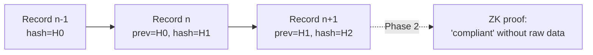

# 07 — Audit & Compliance (the Proof Layer)

Every decision the control plane makes becomes **evidence**. This layer makes that evidence
**tamper-evident**, queryable, and mapped to the compliance frameworks enterprises must answer
to.

## Tamper-evident audit log

| Capability | Phase | Design |
|------------|-------|--------|
| **Immutable audit logs** | 0 | Append-only table where each `AuditRecord` includes the hash of the previous record (**hash chain**). Any retroactive edit breaks the chain and is detectable. |
| **Decision records** | 0 | Each record links `AgentAction` → `Decision` → fired policies/principles → outcome. |
| **Policy evidence** | 0 | Records carry the exact policy/constitution version that evaluated the action. |
| **Merkle DAG logs** | 1 | Upgrade the hash chain to a Merkle DAG for efficient inclusion proofs and partial disclosure. |
| **Zero-knowledge compliance proofs** | 2 | Prove properties (*"no PII was exfiltrated", "all actions were policy-compliant"*) **without revealing** the underlying prompts/data, via RISC Zero / SP1. The flagship audit differentiator. |

### What gets redacted

Sensitive payloads are redacted *at write time* per policy, so the log is safe to retain and
share. The hash chain covers the redacted record; ZK proofs (Phase 2) let auditors verify
compliance over data they never see.

## Compliance mapping

The compliance engine maps decision evidence onto external frameworks so a report can be
produced on demand.

| Framework | Phase | Coverage |
|-----------|-------|----------|
| **OWASP Agentic Top 10** | 0 | Each detector/policy maps to the relevant agentic risk categories. |
| **NIST AI RMF** | 0 | Govern/Map/Measure/Manage evidence from policy + audit. |
| **EU AI Act** | 1 | Risk classification, logging, human-oversight evidence. |
| **SOC 2** | 1 | Control evidence (access, change, monitoring) from the audit log. |
| **Compliance reports** | 1 | One-click export of evidence bundles per framework and time range. |

## Why this beats AGT

AGT provides tamper-evident logs. agentos-guard adds (a) **policy-version provenance** on every
record, (b) **framework mapping** so evidence is audit-ready, and (c) the Phase 2
**zero-knowledge** capability to prove compliance in regulated industries *without disclosing
sensitive context* — something static-log approaches cannot do. See
[`30-comparison-agt.md`](30-comparison-agt.md).
