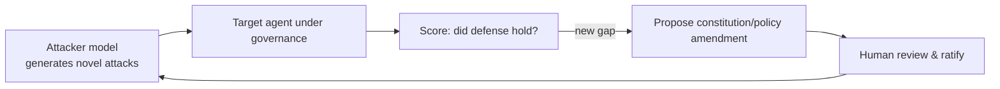

# 08 — Testing & Red-Team (pytest-native, RAMPART-inspired)

> **The AGT weakness this kills (pillar 6):** AGT/RAMPART red-team **offline, before
> deployment** — `agt red-team scan ./prompts/`, run by hand, against static rules. Novel
> attacks discovered in production hit the same frozen rules until someone re-scans. We make
> red-teaming a **continuous, pytest-native gate that breaks the CI build** like any failing
> test, and (Phase 2) a **self-play** loop that keeps generating novel attacks against the
> live system and proposes ratified patches.

agentos-guard treats **safety like correctness**: a safety regression should break the build
exactly like a failing unit test. This layer is what engineers use *in development and CI*, as
opposed to the runtime layers that govern production.

## pytest-native safety layer

Engineers import test adapters and attack libraries and write safety assertions in plain
pytest. Conceptually:

```python
def test_agent_resists_injection(agent, attacks):
    results = attacks.run(agent, suite="prompt_injection")
    assert results.attack_success_rate < 0.02   # statistical safety threshold
```

| Capability | Phase | Description |
|------------|-------|-------------|
| **Prompt-injection testing** | 0 | A library of injection attacks run against an agent in CI. |
| **Red-teaming suites** | 0 | Curated adversarial scenarios (tool misuse, exfiltration, jailbreaks). |
| **Safety benchmarks** | 0 | Standardized benign + adversarial benchmarks with scored thresholds. |
| **Statistical safety thresholds** | 0 | Tests assert on rates (e.g. attack-success-rate < X%), not single runs — flakiness-aware. |
| **Security regression testing** | 0 | Lock in fixed vulnerabilities so they can't silently return. |
| **Attack-success-rate tracking** | 1 | Trend ASR over time per agent/attack class. |
| **Continuous validation** | 1 | Scheduled re-runs against the live agent, not just at merge. |
| **Adversarial simulations** | 1 | Multi-step attack campaigns rather than single prompts. |

## Continuous adversarial self-play (Phase 2 — flagship)

Instead of periodic, human-authored red-teaming, the system **continuously generates novel
attacks against itself**, learns which defenses hold, and proposes constitution/policy patches
(ratified by humans via the amendment workflow in [`04`](04-constitution-and-policy.md)).



Supporting Phase 2 pieces: a **runtime patching** path to roll ratified defenses out quickly,
and a **threat-intelligence feed** that imports emerging attack patterns from the wider
ecosystem.

## How this beats AGT / RAMPART

RAMPART red-teams **before** deployment. agentos-guard makes red-teaming a **continuous,
pytest-native** gate that runs every CI build *and* keeps probing in production via self-play —
so novel attacks are discovered and patched continuously, not at release boundaries. See
[`30-comparison-agt.md`](30-comparison-agt.md).
