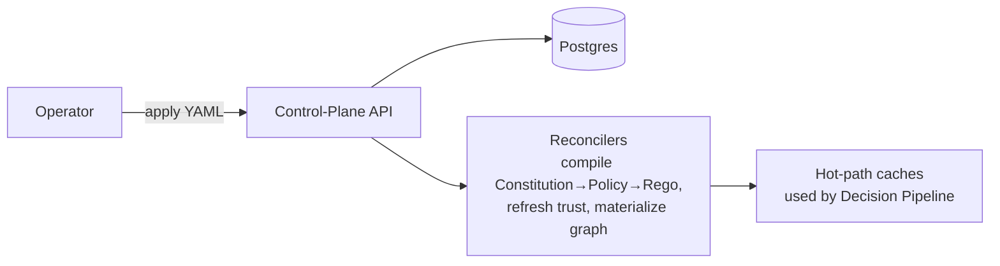

# 10 — Control-Plane API, SDK & Dashboard

How operators configure the system and how agents connect to it.

## Declarative Control-Plane API

Following the Kubernetes model, everything is a **declarative resource** the API server
validates, versions, and reconciles toward desired state.

| Resource | Declares |
|----------|----------|
| `Agent` | Identity, owner, framework, declared tools/permissions, trust-profile ref. |
| `Constitution` | Governing principles (human-readable). |
| `Policy` | Compiled rule sets scoped to agents/tools/actions. |
| `TrustProfile` | Trust/reputation configuration and thresholds. |
| `ApprovalRequest` | Pending human-in-the-loop decisions. |
| `ABOM` | Agent dependency manifest. |

**Reconciliation loops** (Phase 1+) continuously drive derived state: compiling
constitutions into policy, refreshing trust scores, materializing the agent graph, and warming
the hot-path caches the Decision Pipeline reads. Phase 0 can compile on write; loops make it
robust at scale.

## Python SDK (Phase 0)

The primary integration surface. It provides:

- **Interception decorators/middleware** for LangChain/LangGraph (the PEP,
  [`03`](03-interception-and-pipeline.md)).
- **Registration** — agents self-register and receive an identity token
  ([`06`](06-identity-trust-discovery.md)).
- **pytest adapters** — the testing/red-team layer ([`08`](08-testing-and-redteam.md)).
- A **control-plane client** for resource CRUD and approvals.

Additional SDKs (TypeScript, Go) are deferred until after the Python surface stabilizes
([`adr/0001-python-first.md`](adr/0001-python-first.md)).

## Dashboard

A governance-observability UI: the live agent graph, per-agent SLOs and violations, pending
approvals, audit/compliance browsing, attack visualization, and the kill-switch/emergency-stop
controls. Phase 0 ships a minimal read-only + approvals + kill-switch UI; richer views land in
Phase 1 alongside the observability and economics engines.

## Deployment posture

- **Phase 0:** self-hosted control plane (API + Postgres + dashboard) + the Python SDK in the
  agent process. No Kubernetes required.
- **Phase 1:** optional gateway/proxy deployment for framework-agnostic interception.
- **Phase 2:** Kubernetes-native operator + sidecars for a true data-plane control plane.
